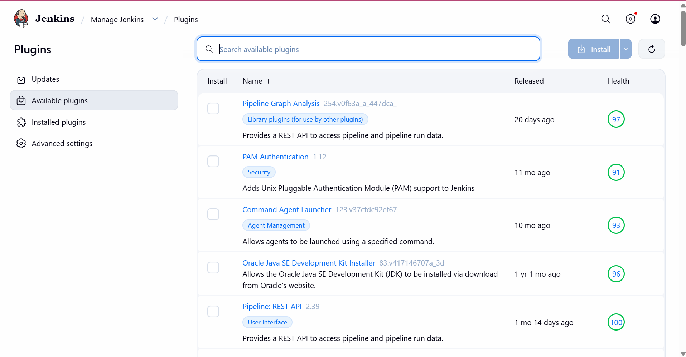
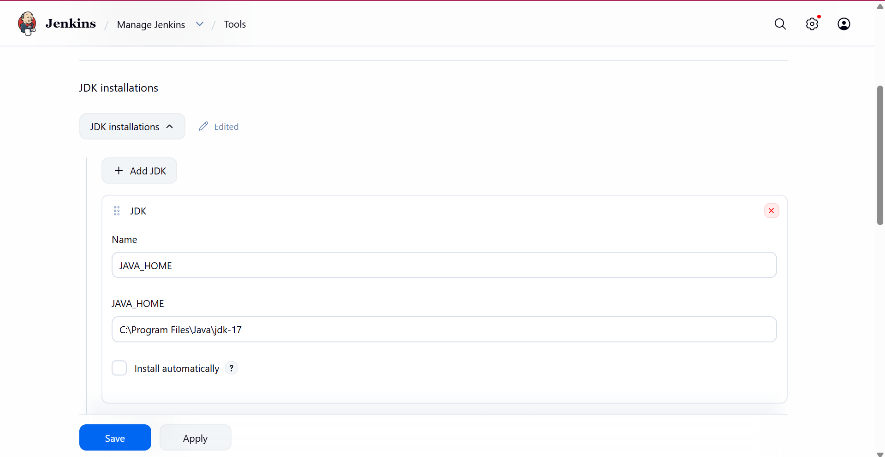
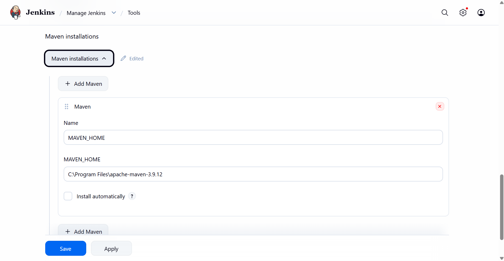
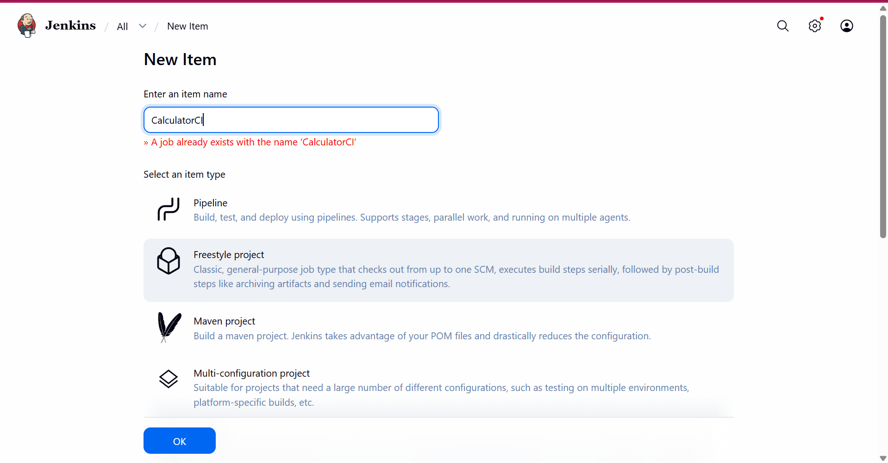
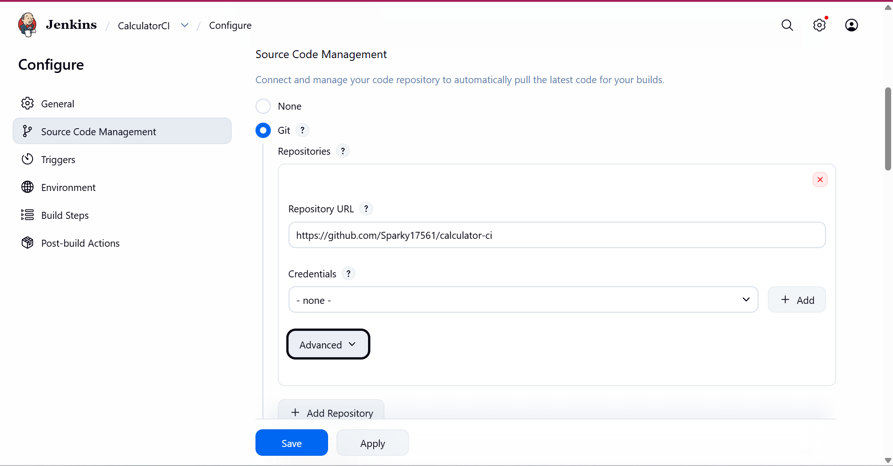
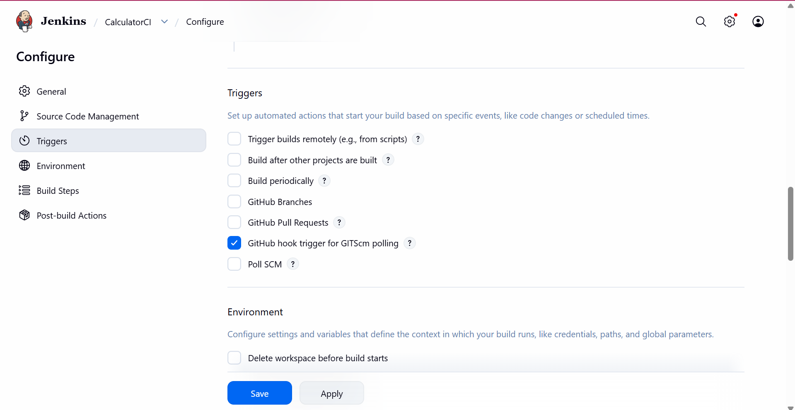
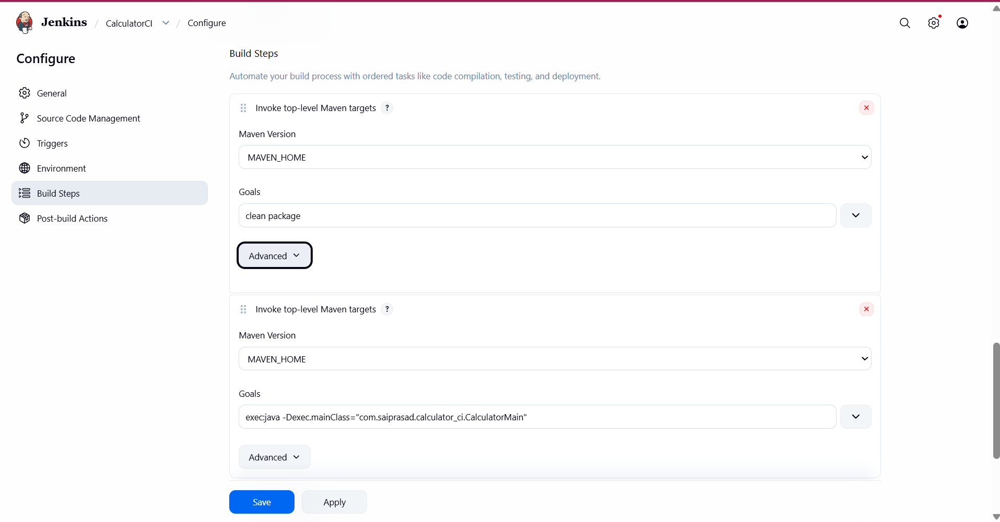
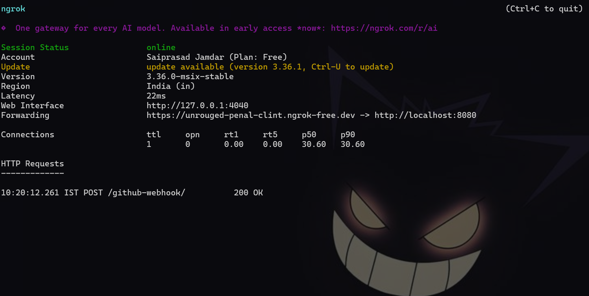
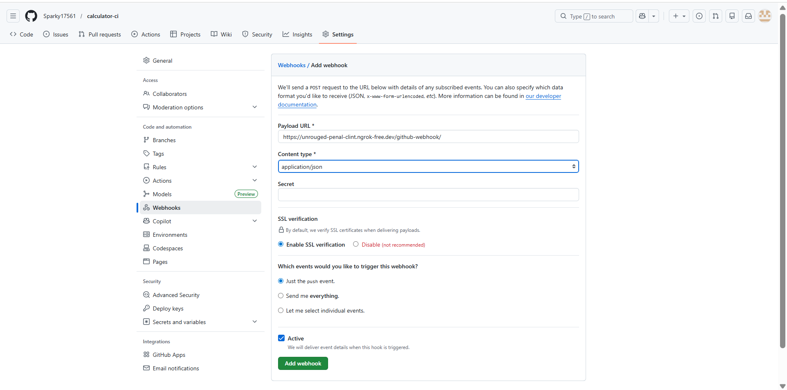

# ✅ **Calculator CI/CD Assignment – Complete Guide**

This guide shows how to build a **Java Maven project**, push to GitHub, and configure **Jenkins CI with webhook** so every code change builds automatically.

Works with:

• STS (Spring Tool Suite)
• Maven
• GitHub
• Jenkins
• ngrok
• JUnit

---

# ✅ **STEP 0 — Install Requirements**

Install:

• JDK 17
• STS / Eclipse
• Maven
• Git
• Jenkins
• ngrok

Check:

```bash
java -version
mvn -version
git --version
```

Start Jenkins:

```
http://localhost:8080
```

---

# ✅ **STEP 1 — Install Jenkins Plugins**

Manage Jenkins → Plugins → Install:

• Git Plugin
• GitHub Plugin
• Maven Integration Plugin



---

# ✅ **STEP 2 — Configure JDK in Jenkins**

Manage Jenkins → Global Tool Configuration → Add JDK.



---

# ✅ **STEP 3 — Configure Maven in Jenkins**

Add Maven tool:

Name → Maven-3
Install automatically.



---

# ✅ **STEP 4 — Create Jenkins Job**

Dashboard → New Item → Freestyle Project → `calculator-ci`.



---

# ✅ **STEP 5 — Connect GitHub Repo**

Source Code Management → Git → Paste repo URL.



---

# ✅ **STEP 6 — Configure Build Trigger**

Enable webhook trigger:

✔ GitHub hook trigger for GITScm polling



---

# ✅ **STEP 7 — Add Build Steps**

Add Maven build steps:

1️⃣ `clean package`
2️⃣ `exec:java -Dexec.mainClass=com.saiprasad.calculator_ci.CalculatorMain`



---

# ✅ **STEP 8 — Run ngrok**

Run:

```bash
ngrok http 8080
```

Copy HTTPS URL.



---

# ✅ **STEP 9 — Configure GitHub Webhook**

GitHub → Settings → Webhooks → Add webhook.

Payload URL:

```
https://xxxxx.ngrok-free.dev/github-webhook/
```



---

# ✅ **STEP 10 — Test CI**

Make change → commit → push:

```bash
git add .
git commit -m "test webhook"
git push
```

Jenkins should start automatically.

---

# ✅ **STEP 11 — Expected Output**

Jenkins Console:

```
Tests run: 5, Failures: 0
Add = 15
Sub = 5
Mul = 50
Div = 2
BUILD SUCCESS
```

---

# ✅ **STEP 12 — How CI Works**

1. Push code
2. GitHub webhook → Jenkins
3. Jenkins pulls repo
4. Maven builds
5. JUnit tests run
6. App runs

This is Continuous Integration.

